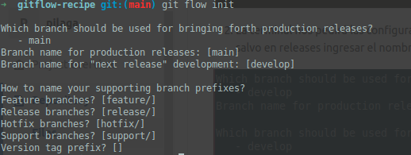

## Algunas referencias utiles
* [Git flow](https://nvie.com/posts/a-successful-git-branching-model/)
* [Git flow Cheatsheet](https://danielkummer.github.io/git-flow-cheatsheet/)

# Git Flow Recipe

Guías sobre el uso de Git-flow

## Contenido

* [Versionado Semántico](#versionado-semantico)
* [Git Clone descargando el repo](#git-clone-descargando-el-repo)
* [Git Flow en un repositorio clonado](#git-flow-en-un-repositorio-clonado)
* [Posicionarse sobre un feature branch existente](#posicionarse-sobre-un-feature-branch-existente)
* [Keep calm and git stash](#keep-calm-and-git-stash)
* [Realizar un feature](#realizar-un-feature)
* [Realizar un release](#realizar-un-release)
* [Realizar un hotfix](#realizar-un-hotfix)
* [Realizar support branches](#realizar-support-branches)

## Versionado Semántico

Se propone la siguiente nomenclatura para los números de versión de un proyecto considerando un formato de versión del tipo X.Y.Z (Mayor.Menor.Revisión).

Los arreglos de bugs que no cambian el proyecto incrementan la revisión, los cambios y adiciones que no rompen la compatibilidad de las dependencias anteriores incrementan el menor, y los cambios que rompen la compatibilidad incrementan el mayor.

## Git clone descargando el repo

1. Clonamos repositorio.
```
git clone https://github.com/darioaha/gitflow-recipe.git
```

## Git Flow en un repositorio clonado

**¡Atencion!**: Esto se debe realizar cada vez que se descarga un nuevo repositorio (Paso Anterior)

Con la terminal en el directorio de nuestro repositorio descargado.

1. Ejecutamos el siguiente comando para inicializar git flow.
```
git flow init
```
2. La terminal nos pedirá las configuraciones a utilizar (nombre del branch master, develop, prefijo branch feautre, etc.). Dejar los valores por defecto salvo en releases ingresar el nombre 'master'



¡Seguimos!

## Posicionarse sobre feature branch existente

¡Para trabajar sobre una feature en test o desarrollo!

Con la terminal en el directorio de nuestro repositorio.

1. Ejecutamos el siguiente comando para actualizar develop
```
git pull origin develop
```

2. Ejecutamos el siguiente comando para consultar todas las ramas del repositorio (remotas y locales).
```
git branch -a
```

3. Buscamos la rama con el nombre que comienza con el prefijo **remotes/origin/feature/nombre-rama-buscada**.

4. Copiamos todo el nombre  **nombre-rama-buscada** y ejecutamos el comando.

```
git flow feature track nombre-rama-buscada
```
Este comando nos descargara y posicionara sobre la rama remota .

Otra opción es copiar todo el nombre  **remotes/origin/feature/nombre-rama-buscada** y ejecutar el comando.
```
git checkout remotes/origin/feature/nombre-rama-buscada
```
Este comando nos moverá a la referencia de la rama remota.

Ya tenemos nuestro repositorio posicionado sobre la rama en la cual queremos desarrollar nuestra feature. 
¡Seguimos!

## Keep calm and git stash

Algunas veces queremos pasarnos de branch o descargar algo sin realizar commit de nuestros cambios locales.
Para hacer esto, git proporciona la herramienta stash:

1. Guardar cambios sobre archivos modificados

```
git stash
# recomendable con un mensaje especifico
git stash save "Este stash es de la funcionalidad X"
```

2. Recuperar último stash
```
git stash pop
```

3. Listar stashes
```
git stash list
```

4. Recuperar un stash especifico
```
git stash pop stash@{0}
```

## Realizar un feature

Para realizar un feature nueva seguimos los siguientes pasos:

Con la terminal en el directorio de nuestro repositorio y nuestra área de trabajo limpia.

1. Nos movemos a la rama local develop (si no estamos en ella)
```
git checkout develop
```

2. Bajamos los cambios del repositorio remoto de la rama develop
```
git pull origin develop
```

3. Iniciamos el feature
```
git flow feature start nombre-feature
```
En pilaga seguimos la nomenclatura para el nombre-feature: *NroTKT-descripcion-feature*

4. Realizamos los cambios para nuestro feature

5. Hacemos commit de nuestros cambios
```
git add <nombre-archivo-1>
git add <nombre-archivo-2>
...
git commit
```
Estos pasos se realizan tantas veces como se desee.

================================================================================
### Finalizada la feature podemos seguir dos caminos:

#### 1. Publicamos la feature y solicitamos merge request sobre gitlab (Pull Request en github)

> Recordar realizar `rebase` antes de publicar y pasar a test

6. Cerramos el feature
```
git flow feature publish nombre-feature
```

7. Creamos merge request en gitlab.siu.edu.ar

#### 2. Cerramos la feature en develop y subimos develop

6. Cerramos el feature
```
git flow feature finish nombre-feature
```

7. Subimos al repositorio remoto en la rama develop
```
git push origin develop
```

Feature complete!
¡Seguimos!

## Release

Para realizar un release, seguimos los siguientes pasos:

Con la terminal en el directorio de nuestro repositorio y nuestra area de trabajo limpia.

1. Nos movemos a la rama local develop
```
$ git checkout develop
```

2. Bajamos los cambios del repositorio remoto de la rama develop
```
$ git pull origin develop
```

3. Nos movemos a la rama local master
```
$ git checkout master
```

4. Bajamos los cambios del repositorio remoto de la rama master
```
$ git pull origin master
```

5. Bajamos los tags del repositorio remoto de la rama master
```
$ git fetch --tags
```

6. Consultamos los tags ya utilizados
```
$ git tag
```

7. Iniciamos el release
```
$ git flow release start tag-de-versión-siguiente
```
Por ejemplo *1.0.1*

8. De ser necesario realizamos los cambios sobre la rama release y ejecutamos ajustes de version
```
vi CHANGELOG.md
vi version
etc
```

9. Cerramos el release
```
$ git flow release finish tag-de-versión-siguiente
```

10. Nos movemos a la rama local master
```
$ git checkout master
```

11. Subimos los cambios y tags a la rama remota master
```
$ git push origin master --tags
```

12. Nos movemos a la rama local develop
```
$ git checkout develop
```

13. Subimos los cambios a la rama remota develop
```
$ git push origin develop
```

Lista la Release!
¡Seguimos!

## Realizar un Hotfix

Para realizar un hotfix, seguimos los siguientes pasos:

Con la terminal, en el directorio de nuestro repositorio y nuestra area de trabajo limpia.

1. Nos movemos a la rama local develop
```
$ git checkout develop
```

2. Bajamos los cambios del repositorio remoto de la rama develop
```
$ git pull origin develop
```

3. Nos movemos a la rama local master
```
$ git checkout master
```

4. Bajamos los cambios del repositorio remoto de la rama master
```
$ git pull origin master
```

5. Bajamos los tags de la repositorio remoto de la rama master
```
$ git fetch --tags
```

6. Consultamos los tags ya utilizados
```
$ git tag
```

7. Iniciamos el hotfix
```
$ git flow hotfix start tag-de-versión-siguiente
```

8. Publicamos el hotfix
```
git flow hotfix publish tag-de-versión-siguiente
```

9. Realizamos los cambios para solucionar el problema

10. Hacemos commit de nuestros cambios
```
git add .
git commit
```

11. Cerramos el hotfix
```
git flow hotfix finish tag-de-versión-siguiente
```
```
git flow hotfix finish tag-de-versión-siguiente --keepremote
```
--keepremote para que no se borre el hotfix

12. Nos movemos a la rama local master
```
git checkout master
```

13. Subimos los cambios y tags a la rama remota master
```
git push origin master --tags
```

14. Nos movemos a la rama local develop
```
git checkout develop
```

15. Subimos los cambios a la rama remota develop
```
git push origin develop
```

¡Listo! Fin del hotfix.

## Support branches

Las ramas de soporte son esenciales si necesita mantener varias versiones principales al mismo tiempo. También podría usar ramas de soporte para soportar versiones menores.

Para realizar un branch support, seguimos los siguientes pasos:

Con la terminal, en el directorio de nuestro repositorio y nuestra area de trabajo limpia.

1. Nos movemos a la rama local master
```
$ git checkout master
```

2. Bajamos los cambios del repositorio remoto de la rama master
```
$ git pull origin master
```

2. Creamos el branch Support

El siguiente comando crea el branch support/v1.6 basado en el tag v1.6.0

```
$ git flow support start v1.6 v1.6.0
```

3. Luego se procede a crear el hotfix basado del branch support creado en el paso anterior

El siguiente comando crea el hotfix/v1.6.1 basado del branch support/v1.6

```
 git flow hotfix start v1.6.1 support/v1.6
```

4. Luego de commitear las correcciones correspondientes y de realizar el bump version se procede a finalizar el hotfix

```
git flow hotfix finish  v1.6.1
```

5. Nos movemos a la rama local master
```
git checkout master
```

6. Subimos los cambios y tags a la rama remota master
```
git push origin master --tags
```

7. Para publicar el branch de support para que quede disponible en el repositorio en el caso de que se quiera sacar otro hotfix de la misma version menor
```
 git push -u origin support/v1.6
```

Con esto finalizamos un hotfix en una version menor.